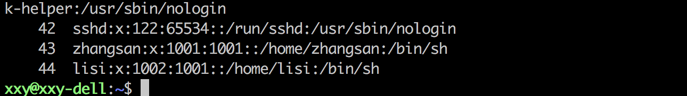

+ 数据成分
  -  有哪些数据类型？如何使用？
+ 运算成分
  -  有哪些运算符号？如何使用？
+ 控制成分
  -  三种类型的控制语句如何书写
+ 传输成分
  -  在程序中如何输入和输出数据

xxy@xxy-dell:~/linux_learning$
用户名@主机名

$表示普通用户
#表示管理员用户

命令行firefox会卡住，可以使用`&`将命令放在后台运行

# 文件时间
文件时间有以下三种：
+ modification time (mtime)：文件的内容更新就会更新
+ status time (ctime)：文件的状态（权限、属性）更新就会更新
+ access time (atime)：读取文件时就会更新

# ls 命令说明
`ls`列出目录的内容
+ Linux下文件和目录的特点
+ Linux文件或目录名最长可以有256个字符
+ 以`.`开头的文件为隐藏文件，需要用-a参数才能显示
+ .代表当前目录
+ ..代表上级目录

## ls常用选项
| 选项 | 含义 |
|-|-|
| -a | 显示指定目录下所有子目录与文件，包含隐藏文件 |
| -l | 以列表方式显示文件的详细信息 |
| -h | 配合-l以人性化的方式显示文件大小 |

## ls通配符的使用
| 通配符 | 含义 |
|-|-|
| * | 代表任意个数的字符 |
| ? | 代表任意一个字符，至少一个 |
| [] | 代表可以匹配字符串组中的任意一个 |
| [abc] | 匹配a、b、c中的任意一个 |
| [a-f] | 匹配a到f范围内的任意一个字符 |

```bash
ls -lh 1?1.txt
```

# 切换命令

| 命令 | 含义 |
|-|-|
| cd | 切换到当前用户的主目录(/home/用户目录) |
| cd ~ | 切换到当前用户的主目录(/home/用户目录) |
| cd . | 保持在当前目录不变 |
| cd ..  |  切换到上级目录 |
| cd -  | 可以在最近两次目录之间来回切换  |

# touch拓展
+ 创建文件或修改文件时间
  - 如果文件**不存在**，可以创建一个空白文件
  - 如果文件**已经存在**，可以修改文件的末次修改日期
    - -a:更新actime
    - -c:更新ctime，若该文件不存在则不建立新文件
    - -m:更新mtime
    - -d:后面可以接更新日期而不使用当前日期，也可以使用 --date="日期或时间"
    - -t:后面可以接更新时间而不使用当前时间，格式为[YYYYMMDDhhmm]

# mkdir拓展
+ 创建一个新的目录

| 选项 | 含义 |
|-|-|
| -p  | 可以递归创建目录 |

举例使用`mkdir -p a/b/c`递归创建文件夹
> **新建目录的名称** 不能与当前目录中 **已有的目录或文件** 同名

# rm拓展
+ 删除文件或目录
> 适应`rm`命令要小心，因为文件删除后不能恢复

| 选项 | 含义 |
|-|-|
| -f | 强制删除，忽略不存在的文件，无需提示 |
| -r | 递归地删除目录下的内容，**删除文件夹** 是必须加此参数 |

# 拷贝和移动文件
| 序号| 命令|含义 |
|-|-|-|
| 01  | tree[目录]|以树状图列出文件目录结构|
| 02  | cp 源文件 目标文件 | 复制文件或目录  |
| 03  | mv 源文件 目标文件 | 移动文件或目录/文件或目录重命名 |

# tree
+ `tree`命令可以以树状图列出文件目录结构

| 选项 | 含义 |
|-|-|
| -d | 只显示目录 |

# cp
+ `cp`命令将给出的**文件**或**目录**复制到另一个文件或目录中，默认是覆盖的

| 选项 | 含义 |
|-|-|
| -i | 覆盖文件前提示  |
| -r | 若给出的源文件是目录文件，则cp将递归复制改目录下的所有子目录和文件，目标文件必须为一个目录名  |

# mv
+ `mv`命令是用来移动文件或目录，也可以给文件或目录重命名
  - 在移动文件或文件夹不需要添加选项
  - 在重命名文件添加-i防止覆盖文件
    - 修改文件夹名也直接使用mv -i旧文件夹名 新文件夹名

| 选项 | 含义 |
|-|-|
| -i | 覆盖文件前提示  |

##查看文件内容

# cat
+ cat命令用来查看文件内容、创建文件、文件合并、追加文件内容等功能
+ cat会一次显示所有的内容，适合查看文件内容较少的文本文件


| 选项 | 含义 |
|-|-|
| -b | 对所非空输出行编号 |
| -n | 对输出所有行编号 |

> Linux中还有一个`nl`命令和`cat -b`的效果等价

# more
+ `more`命令可用于分屏显示文件内容，每次只显示一页内容
+  适用于查看内容较多的文本文件

| 操作键 | 功能 |
|-|-|
| 空格键 | 显示手册页的下一页 |
| Enter键 | 一次滚动手册页的一行 |
| b  | 回滚一屏  |
| f  | 前滚一屏  |
| q  | 退出  |
| /word  | 搜索word字符串  |


# grep
+ `grep`是一种强大的文本搜索工具
+ `grep`允许对文本记性模式查找，所谓的模式查找，又被称为正则表达式

grep a 文件.txt

grep "hello world" 文件.txt

| 选项 | 含义 |
|-|-|
| -n | 显示匹配行及行号 |
| -v | 显示不包含匹配文本的所有行（相当于求反） |
| -i | 忽略大小写  |

常用的两种模式查找

| 参数 | 含义 |
|-|-|
| ^a | 行首，搜索以a开头的行 |
| ke$  | 行尾，搜索以ke结束的行  |

# head
+ 查看一个文件的前n行，如果不指定n，则默认显示前10行
  + `head -n [file]`

# tail
+ 查看一个文件的末n行，如果不指定n，默认显示后10行
  +  `tail -n [file]`
+ 也可以使用文件的动态变化，**变化内容不能是用户手动添加的，例如使用重定向往文件写入**
  + `tail -f [file]`
> 这个命令用来查看系统日志比较多

# less
+ 以较少的内容输出，按下辅助功能键查看更多
  + `less [file]`:
- 如果按下数字就是跳转到指定行
- 空格键向下翻页

# wc
+ 统计文件内容信息（包括行数、单词数、字节数）
  + `wc -lwc [file]`
    + l：表示行数lines，行数
    + w：表示words，单词数
    + c：表示bytes，字节数
> 统计单词是依照空格的，所以-w使用的意义不大

# hostname
+ 操作服务器的主机名

# whoami
+ 查看当前登录用户


# 查阅命令帮助信息
## --help
```bash
command --help
```
## man
```bash
man command
```

# echo 文字内容
> `echo`会在终端中显示参数指定的文字，通常会和**重定向**联合使用

# 重定向
`>`表示输出，会覆盖文件原有的内容
`>>`表示追加，会将内容追加到已有文件的末尾

# 管道
Linux允许将一个命令的输出通过管道作为另一个命令的输入

常用的管道命令有
+ `more`:分屏显示内容
+ `grep`:在命令执行结果的基础上查询指定的文本


# 查看网卡信息
```text
ifconfig | grep inet # 查看网卡对应的IP地址
```

`127.0.0.1`被称为本地回环\回环地址，一般用来检测本机网卡是否正常

# scp
> scp 是一个在linux下用来进行远程拷贝文件的命令

|选项 | 含义 |
|-|-|
| -r | 若给出的源文件是目录，则scp将递归复制该目录下的所有子目录和文件，目标必须是为一个目录名 |
| -P  | 若远程SSH服务器的端口不是22，需要使用大写字母P选定指定端口  |


# SSH高级
+ 免秘钥登录
+ 配置别名

> 提示：有关ssh配置信息都被保存在用户家目录下的.ssh目录下

1）免密码登录

步骤

+ 配置公钥
  - 执行客户端`ssh-keygen`即可生成SSH钥匙(如果有就不用再生成一次)
    - .ssh目录下会生成两个文件id_rsa和id_rsa.pub
+ 上传公钥到服务器
  - 执行`ssh-copy-id user@remote`，可以让远程服务器记住我们的公钥
    - 执行完，服务器家目录/.ssh会有authorized_keys文件

> 本地使用私钥对数据进行加密/解密
> 服务器使用公钥进行加密/解密

非对称加密算法

+ 使用公钥加密的数据，需要使用私钥解密
+ 使用私钥加密的数据，需要使用公钥解密

2）配置别名

每次都要输入ssh -P port user@remote，时间久了很麻烦，特别是当user，remote和port都得输入，而且不好记忆。

而配置别名可以让我们进一步偷懒，譬如用：`ssh mac`来替代上面的一长串，在~/.ssh/config里面追加下面的内容
```text
Host mac(起个别名)
HostName ip地址(服务器ip地址)
User xxy(服务器用户名)
Port 22
IdentitiesOnly yes
```
之后就可以使用 ssh mac直接连接服务器，配合上面的免秘钥登录可以直接使用scp命令进行免密码复制。

# ls -l 扩展
| | 目录 | 拥有者权限 | 组权限| 其他用户权限 |
|- | - | - | - | - |
| 文件权限示例 | - |   |   |
| 目录权限示例 | d |   |   |

+ `ls -l`可以查看文件夹下文件的详细信息，从左到右以此是：
  - **权限**，第一个字符如果是`d`表示目录
  - **硬连接数**，通俗地讲，就是与多少种方式，可以访问到当前目录/文件，子文件夹越多硬连接数约多
  - **拥有者**，家目录下 文件/目录 的拥有者通常都是当前用户
  - **组**，在linux中，很多时候，会出现组名和用户名相同的情况
  - **大小**
  - **时间**
  - **名称**


如果想要在终端使用./来执行*.py脚本，需要在文件开头指定申明脚本信息的内容（第二行为指定中文编码）
> 执行脚本前需要添加执行权限
```python
#!/usr/bin/python or #!/home/xxy/anaconda2/bin/python(绝对路径)
# -*- coding:utf-8 -*-
```

https://www.cnblogs.com/scofi/p/4867851.html

在使用python \*.py时#!/usr/bin/python没有用，想让python程序像普通程序一样运行，例如.\/*.py，这个句子就起作用了，它用来为脚本指定解释器。

通常使用`#!/usr/bin/env python`这种写法在机器上安装了多个版本的python的时候有意义，这样申明，会去你机器PATH中指定的第一个python来执行你的脚本。如果这时候你又配置了虚拟环境的话，那么这样写可以保证脚本会使用你虚拟环境中的 python 来执行。


`#!/usr/bin/python`表示写死了就是要 /usr/bin/python 这个目录下 python 来执行你的脚本。这样写程序的可移植性就差了，如果此路径下python命令不存在就会报错。


-------------------------------------------------------------------------------
# chmod
+ chmod可以修改用户/组 对 文件/目录 的权限
+ 命令格式如下：
```bash
chmod +/-rwx 文件名|目录
```
> 提示：以上方式会一次性修改`拥有者/组`权限

```text
常见的数字组合（u表示用户/g表示组/o表示其他）
777 ==> u=rwx,g=rwx,o=rwx
775 ==> u=rwx,g=rx,o=rx
644 ==> u=rw,g=r,o=r
```
**在修改目录的权限的时候**
如果目录没有可执行权限，那么将没有办法cd到目录，也不能ls
如果没有可写权限，那么目录将没有办法新建文件
如果没有可读权限，那么目录将没有办法ls

# 超级用户
+ 在linux系统中root账号通常用于系统的维护和管理，对操作系统的所有资源具有访问系统
+ 在linux安装过程中，系统会自动创建一个用户，而这个默认的用户就称为“标准用户”

sudo
+ `su`是`substitute user`的缩写，使用另一个用户身份
+ `sudo`命令用来以其他身份来执行命令，预设身份是`root`
+ 用户使用`sudo`时，必须输入密码，之后有5分钟的有效期，超过有效期则必须重新输入密码

> 若未经授权的用户企图使用`root`，则会发出警告邮件给管理员

# 组管理 终端命令
> 提示：创建组/删除组 的终端命令都需要sudo执行


| 序号 | 命令 | 作用 |
| -  | - | - |
| 01  | groupadd 组名 | 添加组  |
| 02  | groupdel 组名 | 删除组 如果要删除的用户组存在用户，需要先删除用户userdel -r 用户名 |
| 03  | cat /etc/group  | 查看组信息  |
| 04  | chgrp -R 组名 文件/目录名  | 修改文件/目录的所属组  |

>提示：
>    组信息保存在`/etc/group`文件中
>
>    `/etc`目录是专门用来保存 `系统配置信息`的目录

在实际应用中，可以预先针对**组**设置好权限，然后将**不同的用户**添加到**对应的组**中，从而**不用依次为每一个用户设置权限**

演练目标

1. 在`python用户`的桌面创建`python学习`目录：  `mkdir python学习`
2. 创建dev组： `sudo groupadd dev`
3. 将`python学习`目录修改为`dev`：`sudo chgrp -R dev python学习`


# 用户管理 终端命令
> 提示：创建用户/删除用户/修改其他用户密码的终端命令都需要通过sudo执行

## 创建用户/设置密码/删除用户
| 序号 | 命令 | 作用| 说明 |
| - | - | - | - |
| 01 | useradd -m -g 组 新建用户名  | 添加新用户  | +-m 自动创建用户家目录； -g 指定用户所在的组，否则会建立一个同名的组|
| 02 | passwd 用户名  | 设置用户密码  | 如果是普通用户，直接用passwd修改自己的密码  |
| 03 | userdel -r 用户名  | 删除用户  | -r选项会自动删除用户家目录  |
| 04 | cat /etc/passwd \| grep 用户名  | 确认用户信息  | 创建用户后，用户信息会保存在/etc/passwd文件中 |

```shell
useradd [option] username

[option]:

-d<登入目录> 指定用户登入时的目录。

-g<群组> 初始群组。

-G<群组> 非初始群组。

-m 自动创建用户的家目录。

-M 不要创建用户的家目录。

-N 不要创建以用户名称为名的群组。

-s 指定用户登入后所使用的shell。
```

提示：
+ 创建用户时，如果忘记添加-m选项指定新用户的家目录——最简单的方法就是删除用户，重新创建
+ 创建用户时，会默认创建一个和用户名同名的组名
+ 用户信息保存在/etc/passwd文件中


### 常见用例
```shell
# 创建一个带有家目录并且可以登录bash的用户（常用）
sudo useradd -m -s /bin/bash tester1

# 指定创建用户家目录的路径
sudo useradd -m -d /home/xxx tester2

# 创建一个没有家目录且不能登录的用户
sudo useradd -s /sbin/nologin tester3

# 创建用户时把用户加入不同的用户组
sudo useradd -m -G xxx,sudo tester4
# 注意各个组名之间用逗号分隔，不能有空格

```

## 查看用户信息
| 序号 | 命令 | 作用|
| - | - | -  |
| 01 | id [用户名] | 查看用户UID和GID信息|
| 02  | who  | 查看当前所有登录的用户列表 |
| 03  | whoami  | 查看当前登录用户的账户名  |

### /etc/passwd文件
`/etc/passwd`文件存放的是用户的信息，由6个冒号组成的7个信息，分别是：
1. 用户名
2. 密码（x，表示加密的密码）
3. UID（用户标识）
4. GID（(主)组标识）
5. 用户全名或本地账号
6. 家目录
7. 登录使用的Shell，就是登录之后，使用的终端命令，ubuntu默认是dash(这是dash不是bash)


---------------------------------------------------------------------------------


用户信息是保存在/etc/passwd文件中，使用`cat -n /etc/passwd`显示

每一列的说明如上以节所示，其中第4列具体指的是主用户组。


用户组信息是保存在/etc/group文件中


# usermod
+ `usermod`可以用来设置用户的主组/附加组和**登陆**shell，命令格式如下：
  - **主组**：通常在新建用户时指定，在`/etc/passwd`的第4的第4列GID对应的组
  - **附加组**：在`/etc/group`中最后一列表示该组的用户列表，用于指定用户的附加权限
> 提示：设置了用户附加组之后，需要重新登陆才能生效！

```bash
# 修改用户的主组（passwd中的GID）一般在新建用户时就指定了，一般不使用usermod修改用户主组
usermod -g 组 用户名

# 修改用户的附加组
usermod -G 组 用户名

# 修改用户**登陆** Shell
usermod -s /bin/bash 用户

# 查看可以使用的shell
cat /etc/shells

# 查看当前使用的shell
echo $SHELL

# 修改使用的shell
chsh -s /bin/bash
```


> 注意：默认使用`useradd`添加的用户是没有权限使用`sudo`以`root`身份执行命令的，可以使用以下命令，将用户添加到`sudo`附加组中
```bash
usermod -G sudo 用户名
```

# 用户管理小结
这部分主要的内容涉及用户组的创建，修改文件或目录用户，新建用户，设置用户密码，查看用户信息，添加附加组。

首先创建一个dev用户组
`sudo groupadd dev`

修改 **文件/文件夹** 用户组，就是`ls -l`结果中用户名、用户组那个用户组
`sudo chgrp -R dev 文件名/目录`

使用`useradd -m -g dev zhangsan`创建用户
设置zhangsan用户密码`sudo passwd zhangsan`
查看zhangsan用户信息
`id zhangsan`
输出：
```text
uid=1001(zhangsan) gid=1001(dev) 组=1001(dev)
```

使用`cat -n /etc/passwd | grep zhangsan`进行验证
```text
43	zhangsan:x:1001:1001::/home/zhangsan:/bin/sh
```

由zhangsan的用户信息“组=1001(dev)”，张三只有一个主祖，和下面的除了主组还有附加组

再比较`id xxy`的结果
```text
uid=1000(xxy) gid=1000(xxy) 组=1000(xxy),4(adm),24(cdrom),27(sudo),30(dip),46(plugdev),116(lpadmin),126(sambashare)
```
xxy用户有sudo等附加组，这也符合上面，将用户添加到用户组中，而不是以此为每个用户添加权限

使用usermod设置用户的主组/附加组
```bash
sudo usermod -G sudo zhangsan
```
此时`id zhangsan`的结果发生了改变
```text
uid=1001(zhangsan) gid=1001(dev) 组=1001(dev),27(sudo)
```
此时`cat -n /etc/group | grep zhangsan`sudo组会变化
```text
21	sudo:x:27:xxy,zhangsan
```

# which(重要)
> 提示：
> + `/etc/passwd`是用于保存用户信息的文件
> + `/usr/bin/passwd`是用于修改用户密码的程序

`which`命令可以查看执行命令所在位置，例如：
```bash
which ls
# 输出:/bin/ls
which passwd
# 输出：/usr/bin/passwd
```

# bin和sbin
+ 在linux中，绝大多数可执行文件都是保存在`/bin`、`sbin`、`/usr/bin`、`/usr/sbin`
  - `/bin`(binary)是二进制执行文件目录，主要用于具体应用
  - `sbin`(system binary)是系统管理员专用的二进制代码存放目录，主要用于系统管理
  - `/usr/bin`(user commands fot applications)后期安装的一些软件
  - `/usr/sbin`(super user commands for applications)超级用户的一些管理程序

> 提示：`cd`命令是内置在系统内核中的，没有独立的文件，因此用`whcih`无法找到`cd`的位置

# 切换用户
| 序号 | 命令 | 作用 | 说明 |
| - | - | - | - |
|01|su - 用户名|切换用户目录|-可以切换到目标用户的家目录，否则保持位置不变|
|02|exit|推出当前登陆账户|

`su`不接用户名,可以切换到`root`，不推荐使用，不安全

# 修改文件权限
| 序号 | 命令 | 作用 |
| - | - | - |
| 01 | chown | 修改拥者 |
| 02 | chgrp | 修改组 |
| 03 | chmod | 修改权限|

命令格式如下：
```bash
# 修改文件|目录拥有者
chown [-R] 用户名 文件名|目标名
#递归修改文件|目录的组
chgrp [-R] 组名 文件名|目录名
# 递归修改文件权限
chmod [-R] 775 文件名|目录名
```

`chmod`在设置权限时，可以简单地使用三个数字分别对应拥有着/组/其他用户的权限
```bash
# 直接修改文件|目录 读|写|执行 权限，但不能精确到 拥有者|组|其他的权限
chmod +/-rwx 文件名|目录名
```
如果不想给权限就设置0

# 系统信息相关命令
## 时间和日期
### date
+ 操作系统时间日期（**读取**、设置

```Shell
# 获取当前时间da
xxy@mac:~$ date
2018年 08月 18日 星期六 14:33:37 CST

xxy@mac:~$ date +%F
2018-08-18
xxy@mac:~$ date "+%Y-%m-%d"
2018-08-18

xxy@mac:~$ date "+%Y-%m-%d %H:%M:%S"
2018-08-18 14:35:04

# 获取之前会或者之后的某个时间（备份）
xxy@mac:~$ date -d "-1 day" "+%Y-%m-%d %H:%M:%S"
2018-08-17 14:35:19

xxy@mac:~$ date -d "-1 year" "+%Y-%m-%d %H:%M:%S"
2017-08-18 14:35:34

# -表示之前，+表示之后
# 可选单位，day（天）、month(月）、year(年）
```

### cal
+ lcalendar查看日历，-y选项可以查看一年的日历
```Shell
xxy@mac:~$ cal -1
      八月 2018
日 一 二 三 四 五 六
          1  2  3  4
 5  6  7  8  9 10 11
12 13 14 15 16 17 18
19 20 21 22 23 24 25
26 27 28 29 30 31
```

## 磁盘信息
### df
`df -h`：disk free显示磁盘剩余空间

### du
 `du -sh [目录名]`:显示当前目录下所有问价的大小
  + s选项是summaries的缩写，
### free
`free -m`:查看内存使用情况（以兆M的单位显示）
  + swap:用于临时内存，当系统真实内存不够用的时候可以使用临时磁盘空间来充当内存


## 进程信息
+ 所谓进行，通俗地讲，当前正在执行的一个程序
| 序号 | 命令 | 作用 |
| - | - | - |
| 01 | ps aux | process status查看进程的详细状况 |
| 02 | top | 动态显示运行中的进程并且排序 |
| 03 | kill[-9] 进行代号 | 终止指定代号的进程，-9代表强制终止 |

`ps`默认只会显示当前用户通过终端启动的应用程序
ps选项说明：
| 选项| 含义|
| - | - |
| a  | 显示终端上的所有进程，包括其他用户的进程  |
| u  | 显示进程的详细信息  |
| x  | 显示没有控制终端的进程（不是通过终端来启动的进程）|


`top`动态显示运行中的进程并且排序，要退出`top`直接输入`q`

`kill`使用时最好只终止由当前用户开启的进程，而不要终止root身份开启的进程，否则可能会导致系统崩溃

# 其他命令

## 查找文件

`find`命令用来在特定的目录下搜索符合条件的文件
| 序号 | 命令 | 作用 |
| - | - | - |
| 01  | find [路径] -name “*.py”  | 查找指定路径下扩展名是.py的文件，包括子目录  |
|02| find [路径] -tyed [-d|-f]| 查找路径下所有目录|文件|


+ 如果路径省略，表示在当前文件夹下查找
+ 可以搭配通配符使用

```bash
# 查找 桌面/ 路径下 包含"1"的文件
find 桌面/ -name "*1*"
# 输出：
桌面/131.txt
桌面/112.txt
桌面/a/b/c/112.txt
桌面/a/b/c/212.txt
桌面/113.txt
桌面/121.txt
桌面/141.txt
```
## 软连接

| 序号 | 命令 | 作用 |
| - | - | - |
| 01  | ls -s 被链接的源文件(完整路径) 链接文件  | 建立文件的软链接，用通俗的方式讲类似于Windows下的快捷方式  |

+ 没有`-s`选项建立的是一个**硬链接**文件
  - 两个文件占用相同大小的硬盘空间，工作中几乎不会建立文件的硬链接
+ **源文件要使用绝对路径**，不能使用相对路径，这样可以方便移动链接文件后，仍能够正常使用

演练目标：
1. 将桌面目录下的01.py移动到demo/b/c目录下
2. 在桌面下新建01.py的软链接，分别用01_xiangdui，01_juedui来命名
3. 将01_xiangdui移动到demo目录下，比较使用相对路基与绝对路径的区别


## 硬链接

在使用`ln`创建链接是，如果没有`-s`选项，会创价一个硬链接，而不是软链接


文件硬链接的示意图


对于软连接，如果删除源文件，软连接将报错。

对于硬链接，删除源文件，即删除文件名
文件数据有硬链接链接，文件不会被删除，硬链接还是可以继续访问文件数据。

> 在linux中，文件名和文件的数据是分开存储的

+ 在linux中，只有文件的硬链接数==0才会被删除
+ 使用`ls -l`可以查看一个文件的硬链接数量
+ 日常生活中，几乎不会建立硬链接


# 打包数据

> 在不同操作系统中，常用的打包数据是不同的
+ Windows常用rar
+ Mac常用zip
+ Linux常用tar.gz

## 打包/解包
`tar`是linux中最常用的备份工具，此命令可以把一系列文件打包到一个大文件中，也可以把一个打包文件恢复成一系列文件

`tar`的命令格式如下：
```bash
# 打包文件
tar -cvf 打包文件.tar 被打包文件/路径...

# 解包文件
tar -xvf 打包文件.tar
```

`tar`选项说明
| 选项 | 含义 |
| - | - |
| c  | 生成文档文件，创建打包文件  |
| x  | 解开打包文件 |
| v  | 列出归档解档的详细过程，显示进度  |
| f  | 指定档案文件名称，f后面一定是.tar文件，所以必须放选项最后 |

**注意：`f`选项必须放在最后，其他选项的顺序可以随意**

###打包/解包训练
1. 创建文件01.py，01.py，03.py
2. 将三个文件打一个py.tar的包：`tar -cvf py.tar *.py`
3. 新建`tar`目录，将py.tar文件移动到`tar`c目录下
4. 解包py.tar：`tar -xvf py.tar`

## 压缩/解压缩
1）gzip
+ tar和gzip命令结合可以实现文件的打包和压缩
  - tar只负责打包，但不压缩
  - 用gzip压缩tar打包后的文件，其扩展名一般用xxx.tar.gz
+ tar命令中-z选项可以调用gzip，从而可以方便地实现压缩与解压缩功能

```bash
# 压缩文件
tar -zcvf 打包文件.tar.gz 被压缩的文件/路径

# 解压缩文件
tar -zxvf 打包文件.tar.gz

# 解压缩到指定目录
tar -zxvf 打包文件.tar.gz -C 目标路径
```

| 选项 | 含义 |
| - | - |
| -C  | 解压缩到指定目录，注意：**要压缩的目录必须存在**  |

2） bzip2
+ tar和bzip2命令结合可以实现文件的打包和压缩
  - tar只负责打包，但不压缩
  - 用bzip2压缩tar打包后的文件，其扩展名一般用xxx.tar.gz
+ tar命令中-j选项可以调用bzip2，从而可以方便地实现压缩与解压缩功能

```bash
# 压缩文件
tar -jcvf 打包文件.tar.gz 被压缩的文件/路径

# 解压缩文件
tar -jxvf 打包文件.tar.gz

# 解压缩到指定目录
tar -jxvf 打包文件.tar.gz -C 目标路径
```
# 软件安装
apt是Advanced Packaging Tool，是Linux下的一款安装包管理工具
可以在终端方便安装/卸载/更新软件包

```bash
# 1. 安装软件
sudo apt install 软件包
# 2. 卸载软件
sudo apt remove 软件包
# 3. 更新已安装的包
sudo apt upgrade
```

```bash
# 一个漂亮的查看当前进程排名的软件
sudo apt install htop
```

# 后台运行程序

运行程序添加`&`，程序将程序后台运行

使用`jobs`查看后台运行程序

使用`ctrl+z`将进程终止

使用`fg`将进程放入前台运行

使用`bg`将程序放到后台运行

使用`ctrl+c`终止进程

`some_command > logfile 2>&1`
将some_command运行过程中的标准输出和标准出错都输出到文件logfile中

# service
`service 服务名 start/stop/restart`
